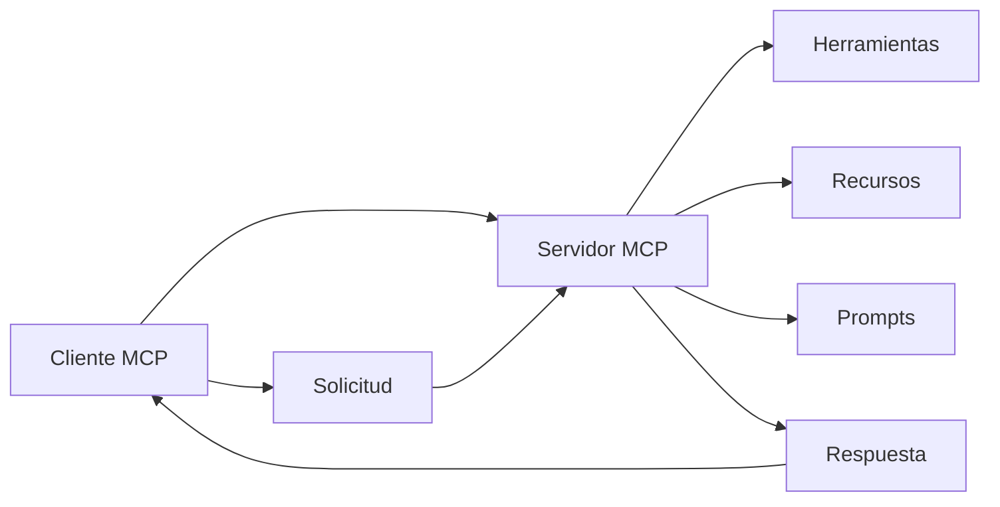

# Ejercicios MCP (Model Context Protocol)

Este directorio contiene ejercicios prácticos para aprender a trabajar con el **Model Context Protocol (MCP)** usando la librería **fastMCP**.

## ✨ Características Destacadas

- 🚀 **Súper Simples**: Cada ejercicio tiene solo 20 líneas de código
- 📦 **Una Sola Dependencia**: Solo necesitas FastMCP
- 🎯 **Perfecto para Principiantes**: Sin complejidades innecesarias
- 📚 **Documentación Completa**: Explicaciones línea por línea
- 🔧 **Listos para Usar**: Scripts de configuración automática

## ¿Qué es MCP?

El **Model Context Protocol** es un protocolo estándar que permite a los modelos de IA acceder a herramientas, recursos y capacidades externas de manera segura y estructurada. MCP facilita la integración entre modelos de lenguaje y servicios externos.

### Conceptos Clave

- **Cliente MCP**: Aplicación que se conecta a servidores MCP para acceder a herramientas y recursos
- **Servidor MCP**: Aplicación que expone herramientas, recursos y prompts a través del protocolo MCP
- **Herramientas (Tools)**: Funciones que el servidor puede ejecutar (ej: calculadora, procesamiento de archivos)
- **Recursos (Resources)**: Datos o contenido que el servidor puede proporcionar (ej: archivos, APIs)
- **Prompts**: Plantillas de texto que ayudan a estructurar la comunicación con el modelo

## Estructura de Ejercicios

### 🎯 Enfoque: Máxima Simplicidad

Estos ejercicios están diseñados para ser **extremadamente simples**. Cada uno tiene solo **20 líneas de código efectivo** y **una sola dependencia** (FastMCP). Perfectos para principiantes.

### 📁 ejercicio-1-cliente/
**Cliente MCP básico** - El ejemplo MÁS SIMPLE posible. Solo 20 líneas de código para aprender a consumir servicios MCP.

### 📁 ejercicio-2-servidor/
**Servidor MCP básico** - El ejemplo MÁS SIMPLE posible. Solo 3 herramientas y 20 líneas de código.

### 📁 diagramas/
Diagramas conceptuales que explican la arquitectura y flujo de comunicación MCP.

## Requisitos Previos

Antes de comenzar con los ejercicios, asegúrate de tener:

- **Python 3.8+** instalado
- **pip** (gestor de paquetes de Python)
- **Entornos virtuales separados** para cada ejercicio (recomendado)

### 📁 Estructura de Entornos

Cada ejercicio tiene su propio entorno virtual independiente:

```
MCP/
├── ejercicio-1-cliente/
│   ├── venv/          # Entorno virtual del cliente
│   ├── requirements.txt
│   └── cliente_exitoso.py
└── ejercicio-2-servidor/
    ├── venv/          # Entorno virtual del servidor
    ├── requirements.txt
    └── servidor_basico.py
```

Esto permite que cada ejercicio tenga sus propias dependencias sin conflictos.

### 🚀 Configuración Rápida del Entorno

**Opción 1: Script Automático (Recomendado)**
```bash
# Ejecutar el script de configuración automática
./setup-desarrollo.sh
```

**Opción 2: Configuración Manual**
```bash
# 1. Crear y activar entorno virtual en cada ejercicio
cd ejercicio-1-cliente
python3 -m venv venv
source venv/bin/activate  # En Windows: venv\Scripts\activate
pip install -r requirements.txt
deactivate
cd ..

cd ejercicio-2-servidor
python3 -m venv venv
source venv/bin/activate  # En Windows: venv\Scripts\activate
pip install -r requirements.txt
deactivate
cd ..
```

### 📦 Configuración con pyproject.toml

Si prefieres usar las herramientas modernas de Python:

```bash
# Instalar en modo desarrollo (incluye dependencias opcionales)
pip install -e ".[dev]"

# O solo las dependencias básicas
pip install -e .
```

## Cómo Usar los Ejercicios

### 🔧 Configuración Inicial (Solo la primera vez)

```bash
# 1. Configurar entorno de desarrollo
./setup-desarrollo.sh

# 2. Activar entorno virtual del ejercicio que vayas a usar
cd ejercicio-1-cliente && source venv/bin/activate
# O para el servidor:
# cd ejercicio-2-servidor && source venv/bin/activate
```

### 📚 Orden Recomendado de Aprendizaje

1. 📖 **Lee** `README.md` (este archivo) - conceptos básicos
2. 🔧 **Configura** el entorno con `./setup-desarrollo.sh`
3. 🎯 **Ejecuta** `ejercicio-1-cliente/` - ¡El MÁS SIMPLE! Solo 20 líneas para consumir servicios MCP
4. 🔧 **Ejecuta** `ejercicio-2-servidor/` - ¡El MÁS SIMPLE! Solo 20 líneas para crear servicios MCP
5. 📊 **Revisa** `diagramas/` para profundizar en la arquitectura

### 💡 Comandos Útiles para el Desarrollo

```bash
# Activar entorno virtual del cliente (siempre antes de trabajar)
cd ejercicio-1-cliente && source venv/bin/activate

# Ejecutar cliente MCP (ejercicio más simple)
python cliente_exitoso.py

# Para trabajar con el servidor, en otra terminal:
cd ejercicio-2-servidor && source venv/bin/activate
python servidor_basico.py

# Verificar instalación
python -c "import fastmcp; print('FastMCP instalado correctamente')"

# Desactivar entorno virtual
deactivate
```

## Flujo de Trabajo Típico



## Documentación Oficial

- [MCP Specification](https://modelcontextprotocol.io/)
- [FastMCP Documentation](https://github.com/jlowin/fastmcp)
- [MCP Python SDK](https://github.com/modelcontextprotocol/python-sdk)

## Troubleshooting Común

### Error de Conexión
- Verifica que el servidor esté ejecutándose: `cd ejercicio-2-servidor && python servidor_basico.py`
- El cliente se conecta via stdio (subprocess), no HTTP
- Revisa que ambos ejercicios tengan sus entornos virtuales activados
- Asegúrate de que FastMCP esté instalado en ambos entornos

### Error de Dependencias
- Asegúrate de tener el entorno virtual activado en cada ejercicio
- Ejecuta `pip install -r requirements.txt` en cada directorio de ejercicio
- Verifica la versión de Python (3.8+)
- Cada ejercicio tiene su propio entorno virtual independiente

### Error de Permisos
- En sistemas Unix, verifica permisos de ejecución
- En Windows, ejecuta como administrador si es necesario

## Próximos Pasos

Una vez completados estos ejercicios básicos, puedes explorar:

- Integración con modelos de IA específicos
- Herramientas más complejas (APIs, bases de datos)
- Recursos dinámicos y streaming
- Autenticación y seguridad
- Deployment y producción

---

**¡Disfruta aprendiendo MCP!** 🚀
