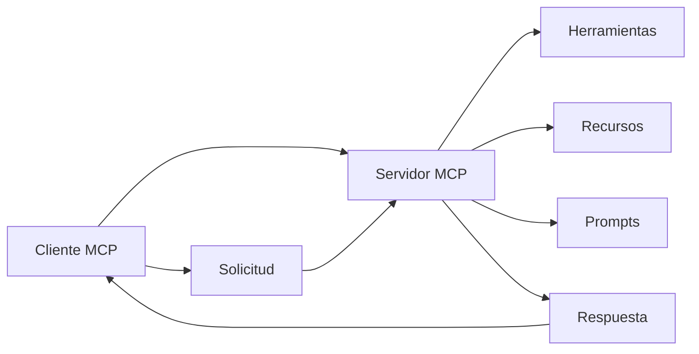

# Ejercicios MCP (Model Context Protocol)

Este directorio contiene ejercicios prácticos para aprender a trabajar con el **Model Context Protocol (MCP)** usando la librería **fastMCP**.

## ¿Qué es MCP?

El **Model Context Protocol** es un protocolo estándar que permite a los modelos de IA acceder a herramientas, recursos y capacidades externas de manera segura y estructurada. MCP facilita la integración entre modelos de lenguaje y servicios externos.

### Conceptos Clave

- **Cliente MCP**: Aplicación que se conecta a servidores MCP para acceder a herramientas y recursos
- **Servidor MCP**: Aplicación que expone herramientas, recursos y prompts a través del protocolo MCP
- **Herramientas (Tools)**: Funciones que el servidor puede ejecutar (ej: calculadora, procesamiento de archivos)
- **Recursos (Resources)**: Datos o contenido que el servidor puede proporcionar (ej: archivos, APIs)
- **Prompts**: Plantillas de texto que ayudan a estructurar la comunicación con el modelo

## Estructura de Ejercicios

### 📁 ejercicio-1-cliente/
**Cliente MCP básico** - Aprende a crear un cliente que se conecta a un servidor MCP y realiza peticiones simples.

### 📁 ejercicio-2-servidor/
**Servidor MCP básico** - Aprende a crear un servidor MCP que expone herramientas simples.

### 📁 diagramas/
Diagramas conceptuales que explican la arquitectura y flujo de comunicación MCP.

## Requisitos Previos

Antes de comenzar con los ejercicios, asegúrate de tener:

- **Python 3.8+** instalado
- **pip** (gestor de paquetes de Python)
- **Entorno virtual** configurado (recomendado)

### 🚀 Configuración Rápida del Entorno

**Opción 1: Script Automático (Recomendado)**
```bash
# Ejecutar el script de configuración automática
./setup-desarrollo.sh
```

**Opción 2: Configuración Manual**
```bash
# 1. Crear y activar entorno virtual
python3 -m venv venv
source venv/bin/activate  # En Windows: venv\Scripts\activate

# 2. Instalar dependencias generales
pip install fastmcp

# 3. Instalar dependencias de cada ejercicio
cd ejercicio-1-cliente && pip install -r requirements.txt && cd ..
cd ejercicio-2-servidor && pip install -r requirements.txt && cd ..
```

### 📦 Configuración con pyproject.toml

Si prefieres usar las herramientas modernas de Python:

```bash
# Instalar en modo desarrollo (incluye dependencias opcionales)
pip install -e ".[dev]"

# O solo las dependencias básicas
pip install -e .
```

## Cómo Usar los Ejercicios

### 🔧 Configuración Inicial (Solo la primera vez)

```bash
# 1. Configurar entorno de desarrollo
./setup-desarrollo.sh

# 2. Activar entorno virtual (cada vez que trabajes)
source venv/bin/activate
```

### 📚 Orden Recomendado de Aprendizaje

1. 📖 **Lee** `README.md` (este archivo) - conceptos básicos
2. 🔧 **Configura** el entorno con `./setup-desarrollo.sh`
3. 🎯 **Ejecuta** `ejercicio-1-cliente/` - aprende a consumir servicios MCP
4. 🔧 **Ejecuta** `ejercicio-2-servidor/` - aprende a crear servicios MCP
5. 📊 **Revisa** `diagramas/` para profundizar en la arquitectura

### 💡 Comandos Útiles para el Desarrollo

```bash
# Activar entorno virtual (siempre antes de trabajar)
source venv/bin/activate

# Ejecutar cliente MCP
cd ejercicio-1-cliente && python cliente_mcp.py

# Ejecutar servidor MCP (en otra terminal)
cd ejercicio-2-servidor && python servidor_mcp.py

# Verificar instalación
python -c "import fastmcp; print('FastMCP instalado correctamente')"

# Desactivar entorno virtual
deactivate
```

## Flujo de Trabajo Típico



## Documentación Oficial

- [MCP Specification](https://modelcontextprotocol.io/)
- [FastMCP Documentation](https://github.com/jlowin/fastmcp)
- [MCP Python SDK](https://github.com/modelcontextprotocol/python-sdk)

## Troubleshooting Común

### Error de Conexión
- Verifica que el servidor esté ejecutándose
- Confirma que la URL y puerto sean correctos
- Revisa los logs del servidor para errores

### Error de Dependencias
- Asegúrate de tener el entorno virtual activado
- Ejecuta `pip install -r requirements.txt` en cada ejercicio
- Verifica la versión de Python (3.8+)

### Error de Permisos
- En sistemas Unix, verifica permisos de ejecución
- En Windows, ejecuta como administrador si es necesario

## Próximos Pasos

Una vez completados estos ejercicios básicos, puedes explorar:

- Integración con modelos de IA específicos
- Herramientas más complejas (APIs, bases de datos)
- Recursos dinámicos y streaming
- Autenticación y seguridad
- Deployment y producción

---

**¡Disfruta aprendiendo MCP!** 🚀
