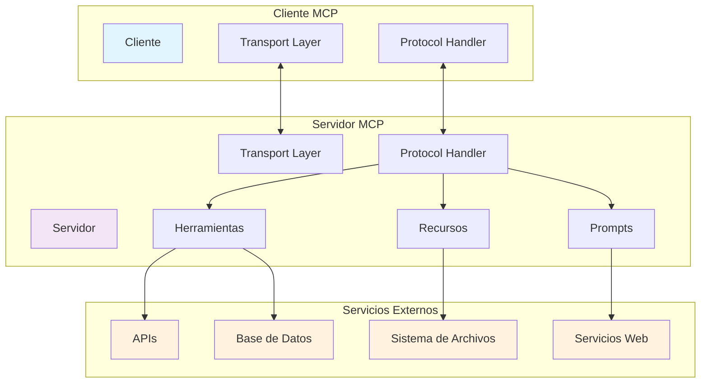
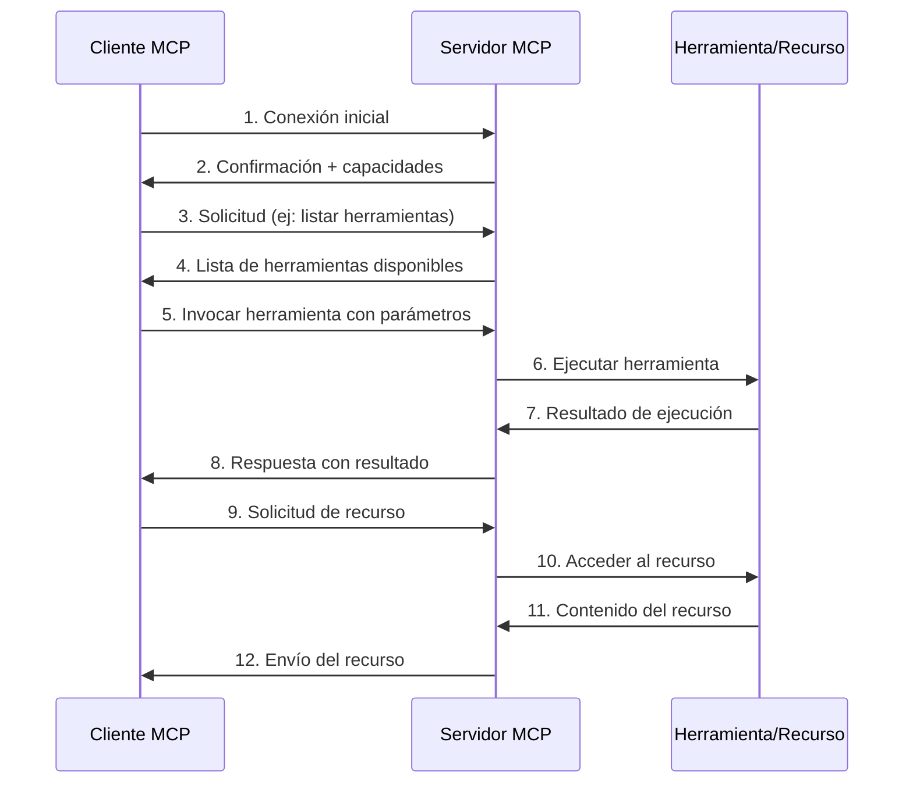
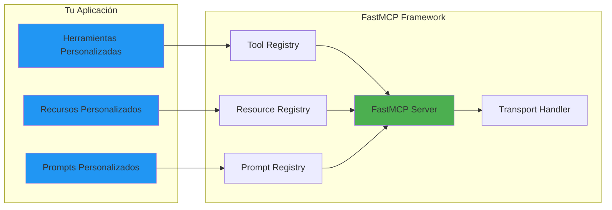

# Arquitectura MCP (Model Context Protocol)

## Diagrama de Arquitectura General

## Componentes Principales

### Cliente MCP
- **Función**: Consumidor de servicios MCP
- **Responsabilidades**:
  - Establecer conexión con servidores MCP
  - Enviar solicitudes (herramientas, recursos, prompts)
  - Procesar respuestas del servidor
  - Manejar errores de comunicación

### Servidor MCP
- **Función**: Proveedor de servicios MCP
- **Responsabilidades**:
  - Exponer herramientas, recursos y prompts
  - Procesar solicitudes del cliente
  - Ejecutar herramientas y devolver resultados
  - Gestionar acceso a recursos externos

## Flujo de Comunicación

## Tipos de Comunicación

### 1. Herramientas (Tools)
- **Propósito**: Ejecutar funciones específicas
- **Ejemplos**: Calculadora, procesamiento de texto, llamadas API
- **Flujo**: Cliente → Parámetros → Servidor → Ejecución → Resultado

### 2. Recursos (Resources)
- **Propósito**: Acceder a datos o contenido
- **Ejemplos**: Archivos, bases de datos, APIs de lectura
- **Flujo**: Cliente → Solicitud → Servidor → Lectura → Contenido

### 3. Prompts
- **Propósito**: Estructurar la comunicación con modelos de IA
- **Ejemplos**: Plantillas de conversación, instrucciones contextuales
- **Flujo**: Cliente → Solicitud → Servidor → Plantilla → Cliente

## Arquitectura de FastMCP

## Beneficios de esta Arquitectura

1. **Modularidad**: Componentes separados y reutilizables
2. **Escalabilidad**: Fácil agregar nuevas herramientas y recursos
3. **Estándar**: Protocolo consistente entre diferentes implementaciones
4. **Seguridad**: Control granular de acceso a herramientas y recursos
5. **Flexibilidad**: Soporte para múltiples tipos de transporte

## Consideraciones de Diseño

### Seguridad
- Validación de parámetros de entrada
- Control de acceso a recursos sensibles
- Autenticación y autorización
- Logging y auditoría

### Performance
- Pool de conexiones
- Caché de recursos frecuentemente accedidos
- Procesamiento asíncrono
- Compresión de datos

### Confiabilidad
- Manejo de errores robusto
- Reintentos automáticos
- Health checks
- Monitoring y alertas
