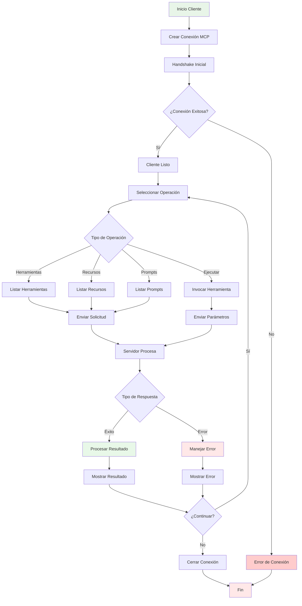
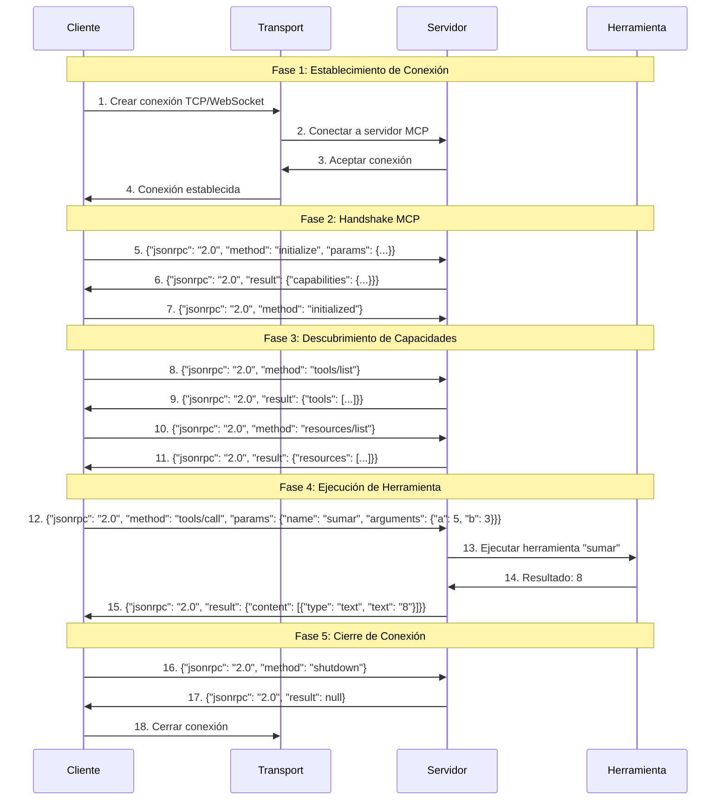
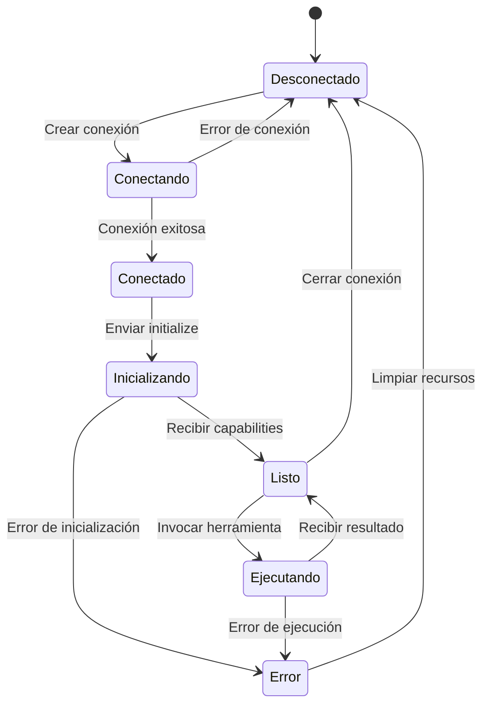
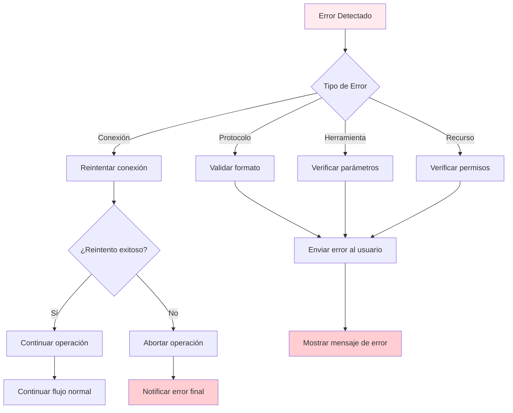

# Flujo de Comunicación Cliente-Servidor MCP

## Diagrama de Flujo Detallado



## Secuencia de Mensajes Detallada



## Tipos de Mensajes JSON-RPC

### 1. Mensajes de Inicialización

**Cliente → Servidor (initialize)**
```json
{
  "jsonrpc": "2.0",
  "id": 1,
  "method": "initialize",
  "params": {
    "protocolVersion": "2024-11-05",
    "capabilities": {
      "tools": {}
    },
    "clientInfo": {
      "name": "mi-cliente-mcp",
      "version": "1.0.0"
    }
  }
}
```

**Servidor → Cliente (response)**
```json
{
  "jsonrpc": "2.0",
  "id": 1,
  "result": {
    "protocolVersion": "2024-11-05",
    "capabilities": {
      "tools": {
        "listChanged": true
      }
    },
    "serverInfo": {
      "name": "mi-servidor-mcp",
      "version": "1.0.0"
    }
  }
}
```

### 2. Mensajes de Herramientas

**Listar herramientas**
```json
{
  "jsonrpc": "2.0",
  "id": 2,
  "method": "tools/list"
}
```

**Respuesta de herramientas**
```json
{
  "jsonrpc": "2.0",
  "id": 2,
  "result": {
    "tools": [
      {
        "name": "sumar",
        "description": "Suma dos números",
        "inputSchema": {
          "type": "object",
          "properties": {
            "a": {"type": "number"},
            "b": {"type": "number"}
          },
          "required": ["a", "b"]
        }
      }
    ]
  }
}
```

**Invocar herramienta**
```json
{
  "jsonrpc": "2.0",
  "id": 3,
  "method": "tools/call",
  "params": {
    "name": "sumar",
    "arguments": {
      "a": 5,
      "b": 3
    }
  }
}
```

**Respuesta de herramienta**
```json
{
  "jsonrpc": "2.0",
  "id": 3,
  "result": {
    "content": [
      {
        "type": "text",
        "text": "8"
      }
    ]
  }
}
```

## Estados del Cliente



## Manejo de Errores

### Tipos de Errores Comunes

1. **Error de Conexión**
   - Servidor no disponible
   - Puerto incorrecto
   - Firewall bloqueando

2. **Error de Protocolo**
   - Versión incompatible
   - Formato JSON inválido
   - Método no soportado

3. **Error de Herramienta**
   - Herramienta no encontrada
   - Parámetros inválidos
   - Error de ejecución

4. **Error de Recurso**
   - Recurso no disponible
   - Permisos insuficientes
   - Archivo no encontrado

### Flujo de Manejo de Errores



## Mejores Prácticas

### Para el Cliente
- Implementar timeout en las conexiones
- Validar respuestas antes de procesarlas
- Manejar reconexión automática
- Logging detallado para debugging

### Para el Servidor
- Validar todos los parámetros de entrada
- Implementar rate limiting
- Proporcionar mensajes de error descriptivos
- Mantener logs de auditoría

### Para la Comunicación
- Usar compresión para mensajes grandes
- Implementar heartbeat para mantener conexión
- Manejar desconexiones inesperadas
- Serialización eficiente de datos
